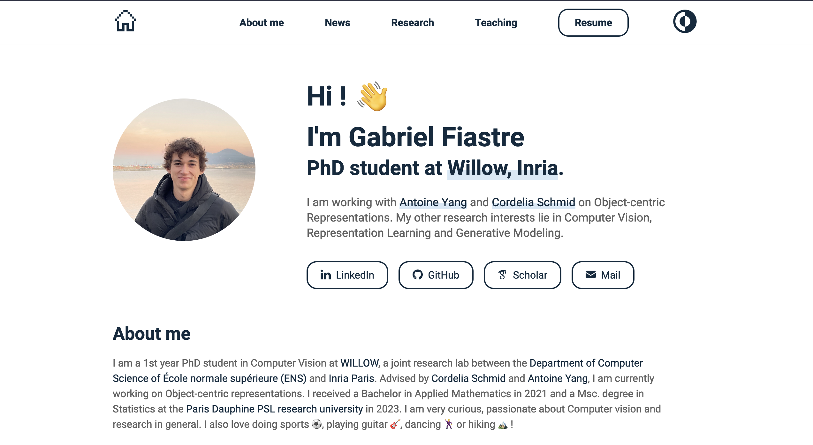
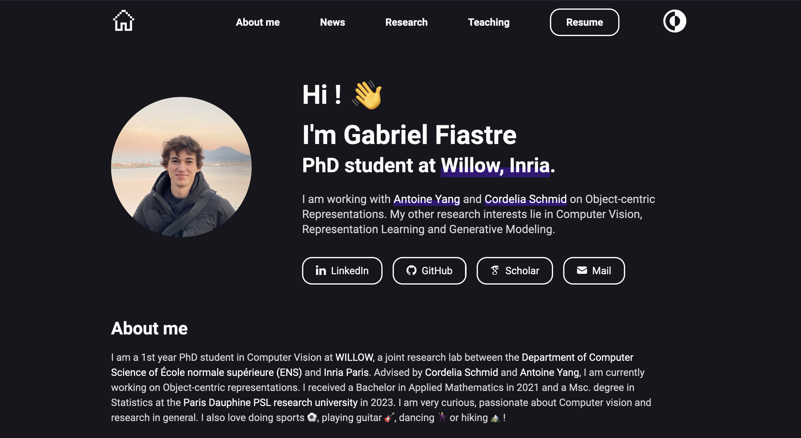

# gabfstr.github.io
[Personal portfolio website](https://gabfstr.github.io/), built upon the Gatsby theme [Portfolio Minimal Theme](https://github.com/konstantinmuenster/gatsby-theme-portfolio-minimal/). Desktop & mobile compatible.

## Table of contents
[Install](#install-dependencies) | [Edit content](#edit-content) | [Development](#development) | [Deployment](#deployment)

## Example

**Light Mode:**





**Dark Mode:**




----------

## Install dependencies

- Copy the repo
```bash
git clone https://github.com/gabfstr/gabfstr.github.io/ mywebpage
```

- [Install nodejs and a package manager](https://docs.npmjs.com/downloading-and-installing-node-js-and-npm) e.g. npm (or yarn)

- Install project dependencies: 
```bash
cd mywebpage
npm install gatsby@5.0.2 -g
npm install --legacy-peer-deps
```


## Edit Content

The [content](/content) folder is reponsible for content information based on predefined sections.
It is organized as such:

    content/
    ├── images           # all project images
    ├── sections         # predefined sections content, each sections contains either a single markdown or JSON file
    │   ├── about        
    |   |   ├── about.md
    │   ├── news         
    |   |   ├── news.json
    │   ...
    │     
    └── settings.json    # general website content settings

The [settings.json](/content/settings.json) file is responsible for the main settings of the page (authorship, title, navigation, social profile links, darkMode preferences...).
Each section content is passed either with a Markdown or JSON file for predefined sections. For adding customized sections, you would need to develop the plugin further and see [development](#development) section. 


## Development


To start developing, navigate to your project directory and run the following commands:

```bash
gatsby develop
```

This will start the local development server at http://localhost:8000.

Between two development runs, clean the caches using:
```bash
gatsby clean
```

You can also open access to you local network for trying the mobile version on your phone by running :
```bash
gatsby develop -H 0.0.0.0 -p 8000
```

The -p (—port) specifies the port number that that you want to use. You can connect to the server by entering http://XXX.XXX.X.XX:8000/ in your mobile browser and replacing XXX.XXX.X.XX with your ip. 
On Macos you can get this IP by runnig in the terminal :
```
ipconfig getifaddr en0
```

## Deployment
To deploy your site, run the following command:

```
npm run deploy
```

This will build your site and deploy it to GitHub Pages.


### Note
In this project Development is done on the `main` branch, and set for Gatsby to publish the built site to the `deployment` branch of the project for GitHub Pages. 
It requires a branch called "deployment" being set as deployment branch for Github Pages (see [here](https://docs.github.com/en/pages/getting-started-with-github-pages/configuring-a-publishing-source-for-your-github-pages-site#choosing-a-publishing-source)).
Else you can edit the chosen branch in the [package.json](/package.json) file
```markdown
{
    "name": ...,
    ...
    "scripts": {
        "deploy": "gatsby build && gh-pages -d public -b <BRANCH_NAME>",
        ...
}
```
